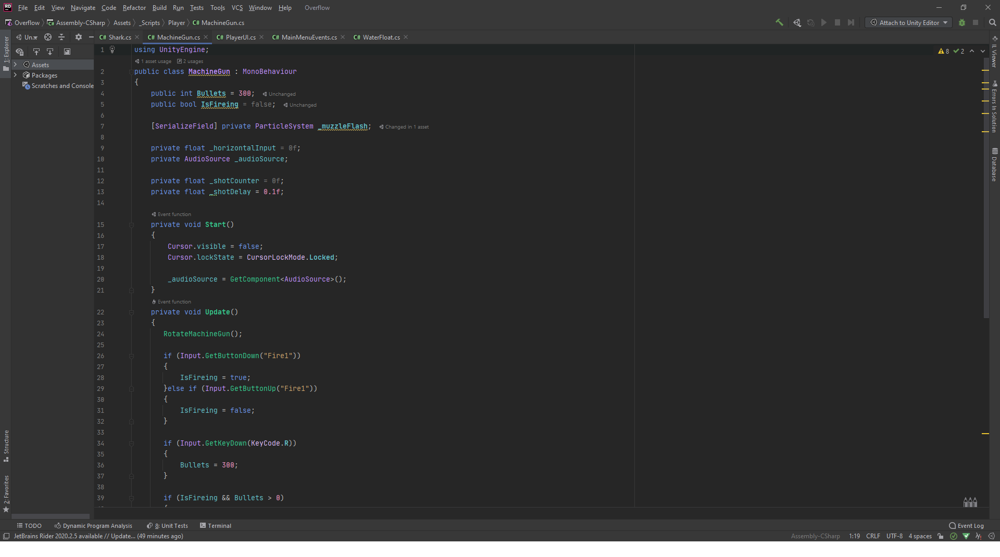

# Welcome To My Portfolio
## Overflow :cowboy_hat_face:

> [!IMPORTANT]
> This is my 30-days(2-3 hours per day) project

+ **Unity**
+ **UI Tollkit**
+ **Splines**
+ **And many more features**

For Unity proggramming i'd prefer using JetBrains Rider.

I am always trying to clean and refactor my code and it's common for me to follow unity|c# naming conventions. 

I'am not reall good at code structure and architecture right now. It's more of a all in once for me, but i'am constantly trying to learn and become better. 

Although, i'am always open for criticism.

> [!NOTE]
> THANK YOU for reading this.

## Other projects :boom:
